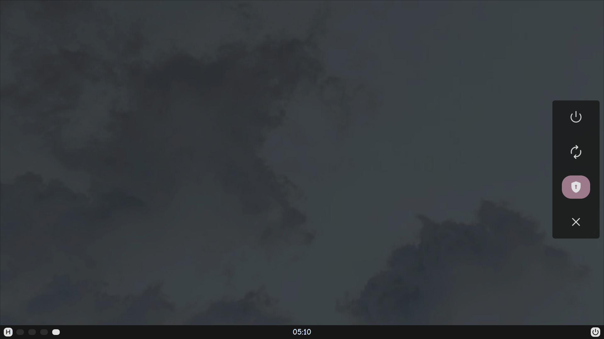
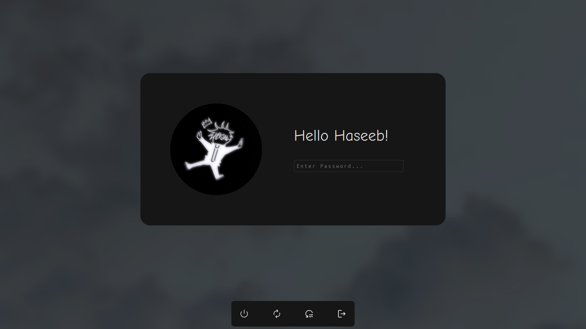

## Introduction

PiUI is a Qt-based toolkit for creating system UI like bars, menus, lockscreens and much more for Linux. It's built on top of PySide6 and follows a declarative approach, allowing you to create UI by passing in properties. It's main goal is to make widget/ui creation as easy as possible for the user.

Still under development. Currently only X11 is supported but Wayland support is on the (very) distant horizon.

## Installation

You can install PiUI directly from the source by:

```bash

git clone https://github.com/haseeebz/PiUi
cd PiUi
python3 -m venv ./.venv
source ./.venv/bin/activate
pip install .

```

## How To

Here is a basic example of a bar in PiUI:

```python
from PiUI.core import Pi 
# shared object, holds all utils you need

from PiUI.components.window import PiBar, Strut
from PiUI.components.widgets import PiLabel

from datetime import datetime

Pi.init() # essential

clock = PiLabel(
	name = "clock", # this is used in stylesheets as well
	text = Pi.poller.Poll(10, func = lambda: datetime.now().strftime("%I:%M %p")),
	hAlign = Pi.Alignment.H.center,
	vAlign = Pi.Alignment.V.center
)

bar = PiBar(
	name = "bar", # for stylesheets + this is the name this window will be referred by.
	side = "bottom",
	size = 42,
	screen = Pi.screen,
	strut = Strut(Pi.screen, bottom = 42),
	widget = clock
)

bar.show()

Pi.controller.addWindow(bar) #allows you to control the window via cli + allows you to modify it from different places in your code

Pi.applyStylesheet("path/to/style.css")

Pi.run() #essential

```

The above example creates a simple bar at the top of the screen that displays the current time.

There is also a cli "pi-ctl" that you can use to manipulate windows externally. If you are installing this toolkit in a venv that the cli script is in ./.venv/bin/, you can either export it to your local applications as:
```bash
mv ./.venv/bin/pi-ctl ~/.local/bin/pi-ctl
```

or just link it as:
```bash
ln ./.venv/bin/pi-ctl ~/.local/bin/pi-ctl
```

Then you can control windows with their "name" property:
```bash
pi-ctl help
pi-ctl hide bar
```

Show it with:
```bash
pi-ctl show bar
```

If you want to end the app properly, you must use:
```bash
pi-ctl quit
```

## More

Here's my current setup:



And the lockscreen:



## Contributing

Contributions would be HIGHLY appreciated because I'm lost lol. For major changes, please open an issue first to discuss what you would like to change.

If you have any suggestions and improvements, please tell me!

## License

[MIT](https://choosealicense.com/licenses/mit/)
